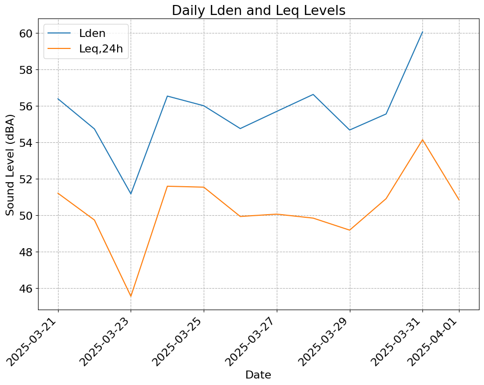

# noisemonitor

Python package for sound level data analysis.

**⚠️ Version 1.0.0 - Breaking Changes:** This major update introduces a new functional API and is not backward-compatible with previous versions. See the [Migration Guide](#migration-from-version-0.0.3) section for details.

**Key Features:**
- **Acoustic indicators** - Implements standard (Leq, Lden, L90, etc.) and research-based noise indicators (HARMONICA, Number of Noise Events, etc.)
- **Flexible data loading** - Support for CSV, Excel, and TXT formats with automatic datetime parsing
- **Two analysis modes** - Summary indicators (discrete values) and profile indicators (time series)
- **Multiprocessing support** - Fast processing of large datasets
- **Easy visualization** - Built-in plotting functions with customizable styles
- **Data coverage validation** - Automated quality checks with configurable thresholds
- **Weather integration** - [Canada only] Merge and analyze data with Canadian weather station data

## Table of Contents
- [Installation](#installation)
- [Quick Start](#quick-start)
- [Data Loading](#data-loading)
- [Data Filtering](#data-filtering)
- [Summary indicators](#summary-indicators-discrete-values)
- [Profile indicators](#profile-indicators-time-series)
- [Weather Integration (Canada)](#weather-integration-canada)
- [Citation](#citation)
- [Dependencies](#dependencies)
- [Migration from Version 0.0.3](#migration-from-version-003)
- [References](#references)

## Installation

Install from PyPI (recommended):
```bash
pip install noisemonitor
```

Install the latest development version from GitHub:
```bash
pip install git+https://github.com/valerianF/noisemonitor
```

## Quick Start

A typical workflow to use the package is to load data using the package's load function `noisemonitor.load()`, eventually filter it, compute desired indicators using functions from either `noisemonitor.summary` (discrete sound level indicators) or `noisemonitor.profile` (time-varying noise profiles) modules, and plot them using functions from the `noisemonitor.display` module. 

```python
import noisemonitor as nm 

# Load data
df_1m = nm.load(
    'tests/data/test_data_laeq1m.csv', # Example dataset with 1-minute LAeq data
    datetimeindex=0,      # Column index for datetime
    valueindexes=1,       # Column index for sound levels
    header=0,
    sep=','
)

# Compute overall Lden (discrete summary indicator)
lden_result = nm.summary.lden(df_1m)
lden_result.head()
```

|   | lden | lday  | levening | lnight |
|---|------|-------|----------|--------|
| 0 | 56.1 | 51.75 | 50.08    | 49.23  |


```python
# Compute periodic (daily) profile (time series with rolling averages)
daily_profile = nm.profile.periodic(
    df_1m,
    hour1=0,
    hour2=23,
    column=0,    # Used throughout the package, this optional argument (default 0) indicates from which column to compute the indicator(s).
    win=3600,    # 1-hour window
    step=1200    # 20-minute step
)

# Visualize the daily profile
nm.display.line(daily_profile, 'Leq', title='Daily Noise Profile')
```


## Data Loading

The `noisemonitor.load()` function imports data from various file formats and automatically handles datetime parsing, timezone conversion, and data resampling, using pandas and dateutil. For easy custom analyses, data is imported into a `pandas.DataFrame` object, as is the output of most noisemonitor functions.

```python
import noisemonitor as nm

# Basic loading
df_1s = nm.load(
    'tests/data/test_data_laeq1s.csv', # Example dataset with 1-second LAeq data
    datetimeindex=0,      # Column index for datetime
    valueindexes=1,       # Column index for sound levels
    header=0,             # Header row index
    sep=','
)

# Load multiple files at once (automatically concatenated)
df2 = nm.load(
    ['day1.csv', 'day2.csv', 'day3.csv'],
    datetimeindex=0,
    valueindexes=[1, 2, 3],    # Multiple sound level columns
    header=0,
    sep=','
)

# Separate date and time columns
df3 = nm.load(
    'data.xlsx',
    dateindex=0,              # Separate date column
    timeindex=1,              # Separate time column
    valueindexes=2,
    timezone='CET',  # Convert from specified timezone to a time-zone unaware format
    header=0
)

# Multiple columns (e.g., octave band levels, LAeq vs. LCeq, etc.)
df_freq = nm.load(
    'tests/data/test_data_freq.csv', # Load data with octave bands levels
    datetimeindex=0, # Column index for datetime
    valueindexes=list(range(1, 9)), # Columns with octave band levels
    header=0,
    sep=','
)
```

**Supported formats:** `.csv`, `.xls`, `.xlsx`, `.txt`

**Note:** Reading large files with datetime parsing can be computationally intensive. Parallel processing is enabled by default (can be deactivated) to reduce loading time.

### Data Filtering

The `noisemonitor.filter` module provides functions to subset data by datetime range, but also to filter extreme values, or according to weather conditions (see the [Weather Integration (Canada)](#weather-integration-canada) for detail).

```python
import noisemonitor as nm
from datetime import datetime

# Filter by date range
df_filtered = nm.filter.all_data(
    df_1m,
    start_datetime=datetime(2025, 3, 23),
    end_datetime=datetime(2025, 3, 29)
)

# Remove extreme outliers (filtered values are set to NaN)
df_filtered = nm.filter.extreme_values(
    df_1m,
    min_value=30,    # Remove values below 30 dBA
    max_value=100     # Remove values above 100 dBA
)
```

## Summary indicators (Discrete Values)

The `noisemonitor.summary` module computes **discrete sound level indicators** that summarize the entire dataset or specific periods (days, weeks, months) with single values. These functions do not compute time series (which are provided in `noisemonitor.profile`, see [Profile indicators](#profile-indicators-time-series)) but rather return aggregate indicators.

### Equivalent level (Leq) and statistical levels (L10, L90, L50)

The `noisemonitor.summary.leq()` function computes the overall or time-filtered (by the time of the day and optionaly day of the week) equivalent level together with statistical sound levels. 

```python
# Overall Leq,24h for entire dataset
overall_leq = nm.summary.leq(df_1s, hour1=0, hour2=24)
overall_leq.head()
```
|   | leq | l10  | l50 | l90 |
|---|-----|------|-----|-----|
| 0 | 49.74 | 52.19 | 47.09 | 42.89 |

```python
# Daytime weekday Leq (7am-7pm) with statistical indicators
weekday_leq = nm.summary.leq(
    laeq1m_data,
    hour1=7,
    hour2=19,
    day1='monday',
    day2='friday',
    stats=False  # Option to disable statistical levels calculation
)
weekday_leq.head()
```
|   | leq |
|---|-----|
| 0 |52.54|

**Note:** To be accurate, statistical levels (L10, L50, L90) require a minimum data refresh rate of 1 second.

### Day-Evening-Night Level (Lden)

The `noisemonitor.summary.lden()` function computes the Day-Evening-Night Level (Lden) following the 2002 European standard (European Parliament and Council, 2002).

```python
# Overall Lden
overall_lden = nm.summary.lden(df_1m)
overall_lden.head()
```
|   | lden | lday  | levening | lnight |
|---|------|-------|----------|--------|
| 0 | 56.1 | 51.75 | 50.08    | 49.23  |

```python
# Weekdays only
weekday_lden = nm.summary.lden(
    df_1m,
    day1='monday',
    day2='friday'
)
weekday_lden.head()
```

|   | lden | lday  | levening | lnight |
|---|------|-------|----------|--------|
| 0 | 56.8 | 52.54 | 49.53    | 50.1   |

### Periodic indicators (Daily/Weekly/Monthly)

The `noisemonitor.summary.periodic()` function computes Leq and at a periodic rate (daily, weekly, or monthly).

```python
# Daily Lden and Leq,24h for each day in the dataset
daily_summary = nm.summary.periodic(
    df_1m,
    freq='D',     # frequency ('D', 'W', or 'MS')
    column=0
)

# Visualization
nm.display.line(
    daily_summary,
    'Lden', 'Leq',
    title="Daily Lden and Leq Levels"
)
```



### HARMONICA indicator

The `noisemonitor.summary.harmonica_periodic()` function computes and plots the HARMONICA index based on Mietlicki et al. (2015). Optionally, this can be computed for specific days of the week (e.g., weekdays only).

```python
# Hourly HARMONICA profile
harmonica_profile = nm.summary.harmonica_periodic(df_1s)
harmonica_profile.head()
```

| Time     | EVT  | BGN  | HARMONICA |
|----------|------|------|-----------|
| 00:00:00 | 2.64 | 0.50 | 3.13      |
| 01:00:00 | 2.38 | 0.34 | 2.72      |
| 02:00:00 | 2.27 | 0.33 | 2.59      |
| 03:00:00 | 2.24 | 0.23 | 2.48      |
| 04:00:00 | 2.65 | 0.39 | 3.04      |


```python
# Visualization
nm.display.harmonica(harmonica_profile)
```


**Note:** This function requires data with a refresh rate equal to or below 1 second.

### Frequency Band Analysis

Summary indicators (e.g., Lden and Leq) can be computed along octave or third-octave sound levels using the `noisemonitor.summary.freq_indicators()` function.

```python
freq_ind = nm.summary.freq_indicators(
    df_freq,
    values=True, # Option to include individual day, night, and evening levels
    stats=False # Option to include statistical levels
)

# Visualize average level per frequency band
nm.display.freq_line(freq_ind, title="Frequency Levels")
```


These indicators can also be computed on a periodic basis (i.e., daily, weekly, or monthly) using the `noisemonitor.summary.freq_periodic()` function.

```python
freq_per = nm.summary.freq_periodic(
    df_freq,
    freq='D', 
    values=True, # Option to include individual day, night, and evening levels
)

# Visualize results on a heatmap
nm.display.freq_map(
    freq_per["Leq,24h"] # Show daily Leq,24h levels
)
```


### Sound Level Distribution Histogram

Count days/weeks by sound level ranges using the `noisemonitor.summary.nday()` function.

```python
# Histogram of days by Lden ranges
histogram, bins = nm.summary.nday(
    df_1m,
    indicator='Lden', # Other options:  'Leq,24h', 'Lday', 'Levening', and 'Lnight'
    bins=[50, 55, 60, 65, 70],  # Bin boundaries
    freq='D',                    # Daily ('D') or weekly ('W')
    column=0
)
histogram.head()
```
|   |	Decibel Range |	Number of Days |
|---|-----------------|----------------|
| 0	| [-inf, 50.0)    |	0              |
| 1	| [50.0, 55.0)    |	4              |
| 2	| [55.0, 60.0)    |	6              |
| 3	| [60.0, 65.0)    |	1              |
| 4	| [65.0, 70.0)    |	0              |

```python
# Visualize with color-coded thresholds
nm.display.nday(
    histogram,  # Use the DataFrame from the tuple
    bins=bins,
    thresholds=[55, 60, 65],     # Color boundaries: green/yellow/orange/red
    title="Days by Lden Range"
)
```


## Profile indicators (Time Series)

The `nm.profile` module computes **time-varying noise profiles** using rolling windows. In contrast with `noisemonitor.summary` (see - [Summary indicators](#summary-indicators-discrete-values)), these functions return time serie (DataFrames with datetime or time index) showing how noise levels evolve over time.

### Complete Time Series

Compute rolling average Leq, L10, L50, and L90 across the entire dataset with the `noisemonitor.profile.series()` function.

```python
# Hourly sliding averages with 20-minute steps
time_series = nm.profile.series(
    df_1m,
    win=7200,           # Window size in seconds (2 hour)
    step=2400,          # Step size in seconds (40 minutes)
    start_at_midnight=True  # Option to start rolling windows at midnight (typically for computing LAeq,24h levels)
)

# Visualize the time series
nm.display.line(
    time_series, 
    'Leq', 'L10', 'L50', 'L90', 
    step=True,
    title='Complete time series'
    )
```


**Note:** L10, L50, and L90 are shown for the example but shouldn't be computed with refresh times above one second. 

### Daily/Weekly Profiles

Compute average profiles representing daily or weekly patterns with the `noisemonitor.profile.periodic()` function.

```python
# Weekday profile (Mon-Fri)
weekday_profile = nm.profile.periodic(
    df_1m,
    hour1=23, # If hour1 > hour2, profile will be computed outside those hours
    hour2=22,
    day1='monday',   # Use day names, not numbers
    day2='friday',
    win=3600,
    step=1200
)

# Weekend profile (Sat-Sun)
weekend_profile = nm.profile.periodic(
    df_1m,
    hour1=0,
    hour2=24,
    day1='saturday',
    day2='sunday',
    win=3600,
    step=1200
)

# Plot weekday values
nm.display.line(
    weekday_profile,
    'Leq', 'L90',
    fill_background=True, # Option to fill background depending on the time of the day.
    title='Weekday Noise Profile' 
)
```


```python
# Compare weekday vs. weekend
nm.display.compare(
    [weekday_profile, weekend_profile],
    ['Weekdays', 'Weekend'],
    'L90', 'Leq'
)
```


### Number of Noise Events (NNE)

The function `noisemonitor.profile.nne()` can compute the Number of Noise Events (NNE) following the algorithm proposed in (Brown and De Coensel, 2018). The function computes the average NNE using rolling windows, computing daily or weekly profiles. Note that this function is computationally expensive as noise NNEs are separately computed for each individual day and then averaged since background levels are relative to each day.

```python
# Average daily noise event profile
nne_profile = nm.profile.nne(
    df_1s,
    hour1=23,
    hour2=22,
    background_type='l50',     # Use L50 as background reference
    exceedance=5,              # Events must exceed background by 10 dB
    min_gap=5,                 # Minimum 5 seconds between events
    win=3600,
    step=1200
)

# Visualize event frequency
nm.display.line(
    nne_profile, 
    'Average NNEs',
    title='Noise Events Profile',
    ylabel='Noise Events (L50 + 5dBA)',
    fill_background=True
)
```


**Note:** As emergence indicators, NNEs shouldn't be computed with refresh times above one second.

### Advanced indicators

Other advanced acoustic indicators can be computed with the `noisemonitor.profile.periodic()` function, such as roughness indicators (DeFrance et al., 2010), Traffic Noise Index (Griffiths and Langdon, 1968) as well as the Noise Pollution Level (Robinson, 1971).

```python
# Daily profile with advanced indicators
advanced_profile = nm.profile.periodic(
    df_1s,
    hour1=7,
    hour2=19,
    win=3600,
    step=1200,
    traffic_noise_indicators=True,
    roughness_indicators=True
)

# Plot roughness indicators
nm.display.line(
    advanced_profile,
    'dLav', 'dLmax,1', 'dLmin,90',
    title='Roughness Indicators'
)
```


```python
# Plot traffic noise indexes and noise pollution levels
nm.display.line(
    advanced_profile,
    'TNI', 'NPL',
    title='Traffic Noise Index and Noise Pollution Level'
)
```


**Note:** Because they are based on statistical indicators, these indicators shouldn't be computed with refresh rates above one second.

### Frequency Band Profiles

As with `noisemonitor.summary` functions, you can compute frequency-wise time series (`noisemonitor.profile.freq_series()`), as well as weekly or daily profiles (`noisemonitor.profile.freq_periodic()`).

```python
# Time series for all frequency bands
freq_series = nm.profile.freq_series(
    df_freq,
    win=7200,
    step=2400
)

# Visualize as heatmap
nm.display.freq_map(freq_series['Leq'], title="Frequency Evolution Over Time")
```


```python
# Daily profiles for each frequency band
freq_daily = nm.profile.freq_periodic(
    df_freq,
    hour1=23,
    hour2=22,
    win=3600,
    step=1200
)

# Visualize daily frequency patterns
nm.display.freq_map(freq_daily['Leq'], title="Daily Frequency Profile")
```


**Note:** being computationnaly expensive, these functions use parallel processing by default. For big datasets, we recommend using `noisemonitor.summary.freq_indicators()` over `noisemonitor.profile.freq_series()`.

## Coverage Checking

Most functions support data coverage validation (deactivated by default). When activated (`coverage_check=True`), coverage (i.e. number of complete cases relative to the size of the dataset) will be assessed based on the computation period (e.g. daily for daily summary indicators; hourly for hourly time series), and results for the corresponding period will be filtered out if coverage requirement (`coverage_threshold` argument) is not met.

```python
with_coverage_leq = nm.summary.leq(
    df_1m,
    hour1=12,
    hour2=16,
    coverage_check=True,
    coverage_threshold=0.8  # Minimum 80% data coverage required
)
```

**Note:** A warning is raised if data coverage is not met for any of the computed periods. For Lden computation, coverage is assessed separately for each period (day, evening, and night).

## Weather Integration (Canada)

The `nm.weather.weathercan` module integrates historical weather data from Environment Canada to correlate noise levels with meteorological conditions. For now, this feature is specific to Canadian weather stations but we seek to integrate other areas. This is an optional dependency that needs to be installed first.

```bash
pip install noisemonitor[weather]
```

### Finding Weather Stations

```python
# Find nearby weather stations
coordinates = [45.505571, -73.598987]  # [lat, lng]

stations = nm.weather.weathercan.get_historical_stations(
    coordinates=coordinates,
    radius=25,           # Search radius in km (25-100)
    start_year=2020,
    end_year=2025
)

stations.T.head()
```

| Station | prov | proximity | id | hlyRange | dlyRange | mlyRange |
|---------|------|-----------|-----|----------|----------|----------|
| MCTAVISH | QC | 1.55 | 10761 | 1994-02-01\|2025-12-09 | 1994-07-26\|2025-12-09 | |
| MONTREAL INTL A | QC | 11.72 | 51157 | 2013-02-13\|2025-12-09 | 2013-02-14\|2025-12-09 | |
| MONTREAL/PIERRE ELLIOTT TRUDEAU INTL | QC | 11.89 | 30165 | 2008-01-08\|2025-12-09 | 2002-12-23\|2025-12-09 | |
| MONTREAL/ST-HUBERT | QC | 14.25 | 48374 | 2009-12-10\|2025-12-09 | 2009-12-17\|2025-12-09 | |
| LAPRAIRIE | QC | 18.76 | 5389 | | 1963-01-01\|2025-10-31 | 1963-01-01\|2018-02-01 |


### Merging Weather Data

```python
# Merge weather data with sound levels
df_with_weather = await nm.weather.weathercan.merge_weather(
    df_1m,
    station_id=30165,                # Station ID from previous step
    wind_speed_flag=18,             # Flag wind speeds >= 18 km/h
    temp_range_flag=(-10, 30),      # Flag temps outside -10°C to 30°C
    hum_flag=90,                    # Flag relative humidity > 90%
    rolling_window_hours=48         # Rolling window for rain/snow flags
)

df_with_weather.head()
```

| datetime | LEQ dB -A | Wind Spd (km/h) | Precip. Amount (mm) | Weather | Temp (°C) | Rel Hum (%) | Wind_Spd_Flag | Rain_Flag | Snow_Flag | Temp_Flag | Rel_Hum_Flag | Rain_Flag_Roll | Snow_Flag_Roll |
|----------|-----------|-----------------|---------------------|---------|-----------|-------------|---------------|-----------|-----------|-----------|--------------|----------------|----------------|
| 2025-03-21 00:00:00 | 47.36 | 12.0 | 0.0 | NaN | 6.6 | 81.0 | True | False | False | False | False | False | False |
| 2025-03-21 00:01:00 | 48.36 | 12.0 | 0.0 | NaN | 6.6 | 81.0 | True | False | False | False | False | False | False |
| 2025-03-21 00:02:00 | 47.60 | 12.0 | 0.0 | NaN | 6.6 | 81.0 | True | False | False | False | False | False | False |
| 2025-03-21 00:03:00 | 48.74 | 12.0 | 0.0 | NaN | 6.6 | 81.0 | True | False | False | False | False | False | False |
| 2025-03-21 00:04:00 | 49.75 | 12.0 | 0.0 | NaN | 6.6 | 81.0 | True | False | False | False | False | False | False |

The merged DataFrame now includes weather data together with boolean flags indicating whether inclusion criteria are fulfilled for each row (e.g., wind speed below 18 km/h).

### Weather Contingency Analysis

Assess the potential impact of weather conditions on sound levels using the `nm.weather.weathercan.contingency_weather_flags()` function.

```python
contingency = nm.weather.weathercan.contingency_weather_flags(
    df_with_weather
)

contingency.head()
```

| Condition | Leq | Lden | Diff Leq | Diff Lden | Covered data (%) |
|-----------|-----|------|----------|-----------|------------------|
| All Data | 50.76 | 56.10 | 0.00 | 0.00 | 100.0 |
| Wind speed >= 18 km/h | 51.04 | 56.12 | 0.28 | 0.02 | 44.8 |
| Rain in the last 48h | 51.37 | 56.65 | 0.61 | 0.55 | 61.9 |
| No Flag - Wind | 50.53 | 56.14 | -0.23 | 0.04 | 55.2 |
| No Flag - Rain | 49.54 | 55.08 | -1.22 | -1.02 | 38.1 |

**Note:** Sound level differences below 1 dB are generally considered negligible.

### Visualizing Weather Impact

```python
# Plot daily profiles for different weather conditions
nm.display.compare_weather_daily(
    df_with_weather,
    column=0,
    include_wind_flag=True,
    include_rain_flag=True,
    win=3600,
    step=1200,
    title="Daily Profiles: Weather Comparison"
)
```


```python
# Plot time series with weather flags overlaid
nm.display.line_weather(
    df_with_weather,
    win=3600,
    include_wind_flag=True,
    include_rain_flag=True
)
```


### Weather-Based Filtering

Once the potential impact of weather conditions (e.g. wind, rain, snow) on sound levels have been analyzed, data can be filtered based on weather conditions to ensure data reliability. 

```python
# Filter by weather conditions (requires weather data merged)
df_filtered = nm.filter.weather_flags(
    df_with_weather,
    filter_wind_flag=True,      # Remove high wind periods
    filter_rain_flag=False,     # Keep rainy periods
    filter_temp_flag=False,     # Keep all temperatures
    filter_rel_hum_flag=False,  # Keep all humidity levels
    filter_snow_flag=False      # Keep snowy periods
)
```

Output:
```
Proportion of values filtered out: 44.80%
```

**Note:** Weather data retrieval is asynchronous. Use `await` with `merge_weather()` or run it in an async context.

## Citation

If you use **noisemonitor**, please consider citing us:

```bibtex
@inproceedings{fraisse2023noisemonitor,
    title={noisemonitor: A Python Package For Sound Level Monitor Analysis},
    author={Fraisse, Valérian},
    booktitle={Acoustics Week in Canada},
    year={2023}
}
```

## Dependencies

- **NumPy** ([numpy.org](https://numpy.org/))
- **pandas** ([pandas.pydata.org](https://pandas.pydata.org/))
- **Matplotlib** ([matplotlib.org](https://matplotlib.org/))

## Migration from version 0.0.3

**Version 1.0.0 introduces breaking changes.** The class-based API (`NoiseMonitor` class) has been replaced with a functional API organized into modules.

### Key Changes

| Version 0.0.3 | Version 1.0.0 |
|------------|-------------|
| `nm.load_data()` | `nm.load()` |
| `nm.filter_data()` | `nm.filter.all_data()` |
| `average = nm.NoiseMonitor(df)` | No class instantiation needed |
| `average.leq()` | `nm.summary.leq(df, ...)` |
| `average.lden()` | `nm.summary.lden(df, ...)` |
| `average.sliding_average()` | `nm.profile.series(df, ...)` |
| `average.daily()` | `nm.profile.periodic(df, ...)` |
| `average.weekly()` | `nm.profile.periodic(df, ...)` |
| `nm.level_plot()` | `nm.display.line()` |

---

## References

- Brown, A. L., & De Coensel, B. (2018). A study of the performance of a generalized exceedance algorithm for detecting noise events caused by road traffic. *Applied Acoustics*, 138, 101-114. https://doi.org/10.1016/j.apacoust.2018.03.031
- DeFrance, J., Palacino. J., & Baulac, M. (2010). Auscultation acoustique des aménagements cyclables en milieu urbain. *Proceedings of the 10ème Congrès Français d’Acoustique*, Lyon, France. https://hal.science/hal-00551186v1
- European Parliament and Council. (2002). Directive 2002/49/EC of the European Parliament and of the Council of 25 June 2002 relating to the assessment and management of environmental noise. *EUR-Lex*. http://data.europa.eu/eli/dir/2002/49/2021-07-29
- Griffiths, I. M., & Langdon, F. J. (1968). Subjective response to road traffic noise. *Journal of Sound and Vibration*, 1, 16-32, 375-378. https://doi.org/10.1016/0022-460X(68)90191-0
- Mietlicki, C., Mietlicky, F., Ribeiro, C., and Gaudiber, P. (2015). The HARMONICA project, new tools to assess environmental noise and better inform the public. *Proceedings of Forum Acusticum*, Krakow, Poland. https://www.bruitparif.fr/pages/En-tete/500%20Innovation%20et%20recherche/700%20Publications%20scientifiques/2014%20-%20The%20HARMONICA%20project.pdf
- Robinson, D. W. (1971). The Concept of Noise Pollution Level. *Journal of Occupational Medicine*, 13(12), 602. https://journals.lww.com/joem/toc/1971/12000