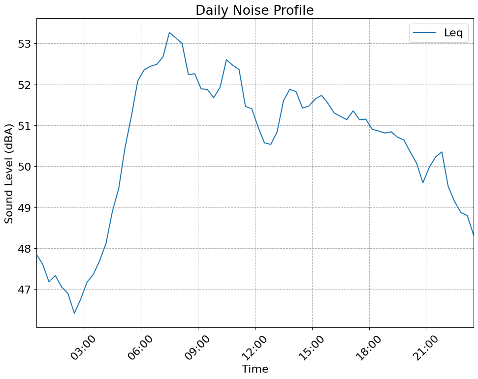

# noisemonitor

Python package for sound level data analysis. See the [Usage Guide](docs/usage.md) for detailed examples and the [API Reference](docs/api.md) for function documentation.

**⚠️ Version 1.0.0 - Breaking Changes:** This major update introduces a new functional API and is not backward-compatible with previous versions. See the [Migration Guide](docs/migration.md) for details.

## Key Features

**Key Features:**
- **Acoustic indicators** - Implements standard (Leq, Lden, L90, etc.) and research-based noise indicators (HARMONICA, Number of Noise Events, etc.)
- **Flexible data loading** - Support for CSV, Excel, and TXT formats with automatic datetime parsing
- **Two analysis modes** - Summary indicators (discrete values) and profile indicators (time series)
- **Multiprocessing support** - Fast processing of large datasets
- **Easy visualization** - Built-in plotting functions with customizable styles
- **Data coverage validation** - Automated quality checks with configurable thresholds
- **Weather integration** - [Canada only] Merge and analyze data with Canadian weather station data

## Table of Contents

- [Installation](#installation)
- [Quick Start](#quick-start)
- [Core Modules](#core-modules)
- [Citation](#citation)
- [License](#license)

## Installation

Install from PyPI:
```bash
pip install noisemonitor
```

For weather integration (Canada only):
```bash
pip install noisemonitor[weather]
```

Install the latest development version:
```bash
pip install git+https://github.com/valerianF/noisemonitor
```

## Quick Start

```python
import noisemonitor as nm

# Load data
df = nm.load(
    'data.csv',
    datetimeindex=0, # Column index for datetime
    valueindexes=1,  # Column index(es) for sound levels
    header=0,        # Header row index
    sep=','
)

# Compute Lden
lden = nm.summary.lden(df)
print(lden)
```

**Output:**
| lden | lday  | levening | lnight |
|------|-------|----------|--------|
| 56.1 | 51.75 | 50.08    | 49.23  |

```python
# Compute daily profile
daily_profile = nm.profile.periodic(
    df,
    hour1=0,
    hour2=23,
    win=3600,    # 1-hour window
    step=1200    # 20-minute step
)

# Visualize
nm.display.line(daily_profile, 'Leq', title='Daily Noise Profile')
```



**noisemonitor** is designed for flexibility and ease of use. All analysis functions accept a `column` parameter, allowing you to specify which data column to analyze (e.g., to work with datasets containing multiple sound level measurements or frequency bands). Most functions return results as pandas DataFrames for easy manipulation.

## Core Modules

### `nm.load()`
Load data from CSV, Excel, or TXT files with automatic datetime parsing.

```python
df = nm.load('data.csv', datetimeindex=0, valueindexes=1, header=0, sep=',')
```

### `nm.filter`
Filter data by datetime, remove outliers, or filter by weather conditions.

```python
df_filtered = nm.filter.extreme_values(df, min_value=30, max_value=100)
```

### `nm.summary`
Compute discrete indicators: Leq, Lden, HARMONICA, frequency analysis, histograms.

```python
overall_lden = nm.summary.lden(df)
daily_lden = nm.summary.periodic(df, freq='D')
harmonica = nm.summary.harmonica_periodic(df)
```

### `nm.profile`
Compute time-varying profiles: time series, daily/weekly patterns, noise events.

```python
time_series = nm.profile.series(df, win=3600, step=1200)
weekday_profile = nm.profile.periodic(df, hour1=0, hour2=23, day1='monday', day2='friday', win=3600)
nne_profile = nm.profile.nne(df, hour1=0, hour2=23, background_type='L50', exceedance=5)
```

### `nm.display`
Visualize results with line plots, comparisons, heatmaps, and more.

```python
nm.display.line(df, 'Leq', 'L10', 'L90', title='Noise Levels')
nm.display.compare([weekday_profile, weekend_profile], ['Weekdays', 'Weekend'], 'Leq')
nm.display.freq_map(freq_data['Leq'], title='Frequency Heatmap')
```

### `nm.weather` (Canada only)
Integrate Environment Canada weather data to analyze weather impact on noise.

```python
stations = nm.weather.weathercan.get_historical_stations(coordinates=[45.5, -73.6], radius=25)
df_weather = await nm.weather.weathercan.merge_weather(df, station_id=30165, wind_speed_flag=18)
contingency = nm.weather.weathercan.contingency_weather_flags(df_weather)
```

## Citation

If you use **noisemonitor**, please consider citing us:

```bibtex
@inproceedings{fraisse2023noisemonitor,
    title={noisemonitor: A Python Package For Sound Level Monitor Analysis},
    author={Fraisse, Valérian},
    booktitle={Acoustics Week in Canada},
    year={2023}
}
```

## Dependencies

- **NumPy** ([numpy.org](https://numpy.org/))
- **pandas** ([pandas.pydata.org](https://pandas.pydata.org/))
- **Matplotlib** ([matplotlib.org](https://matplotlib.org/))

## License

This project is licensed under the Apache License 2.0 - see the [LICENSE](LICENSE) file for details.