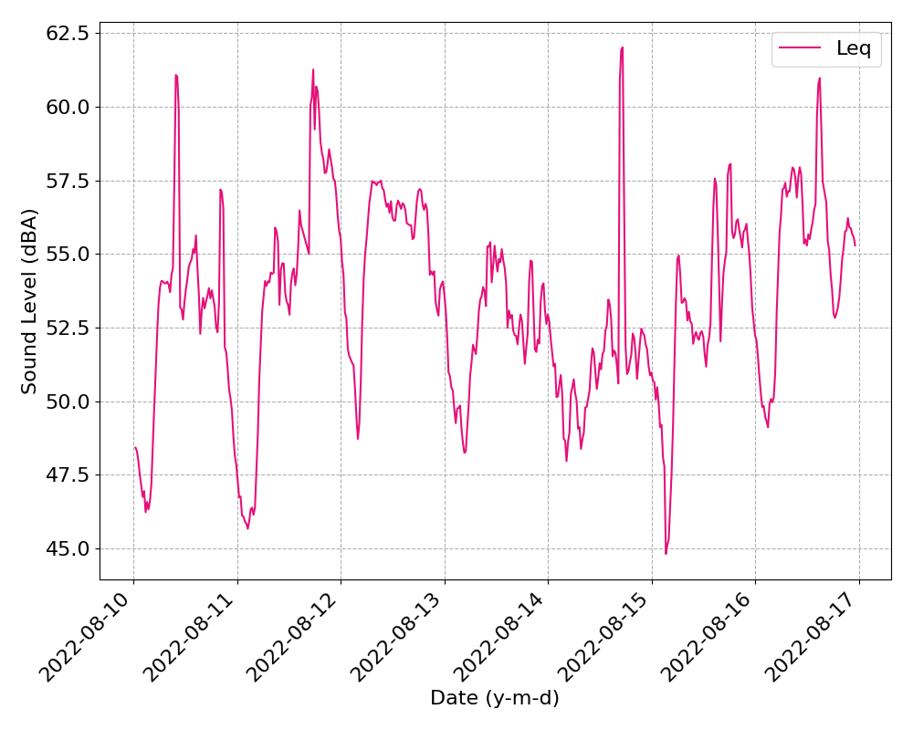
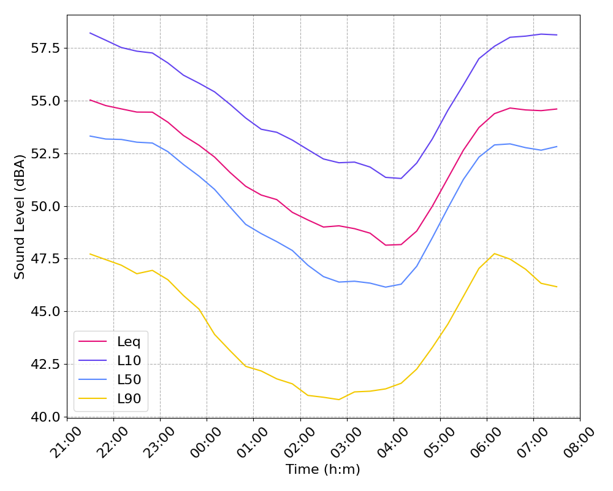
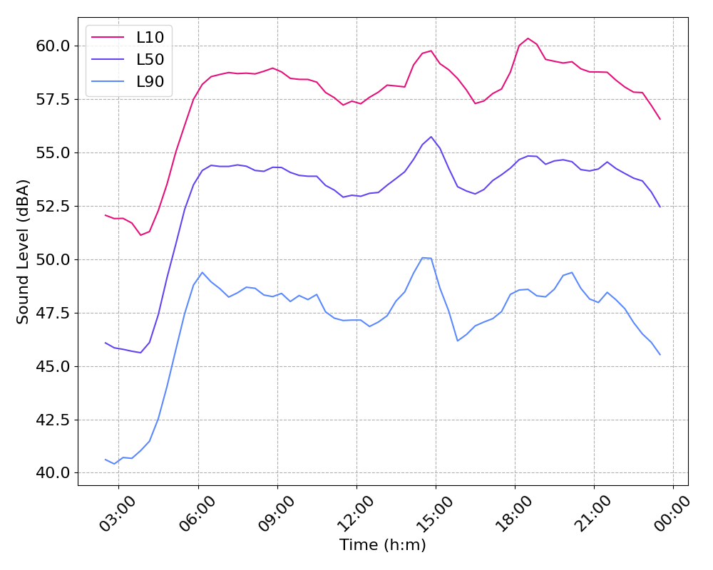
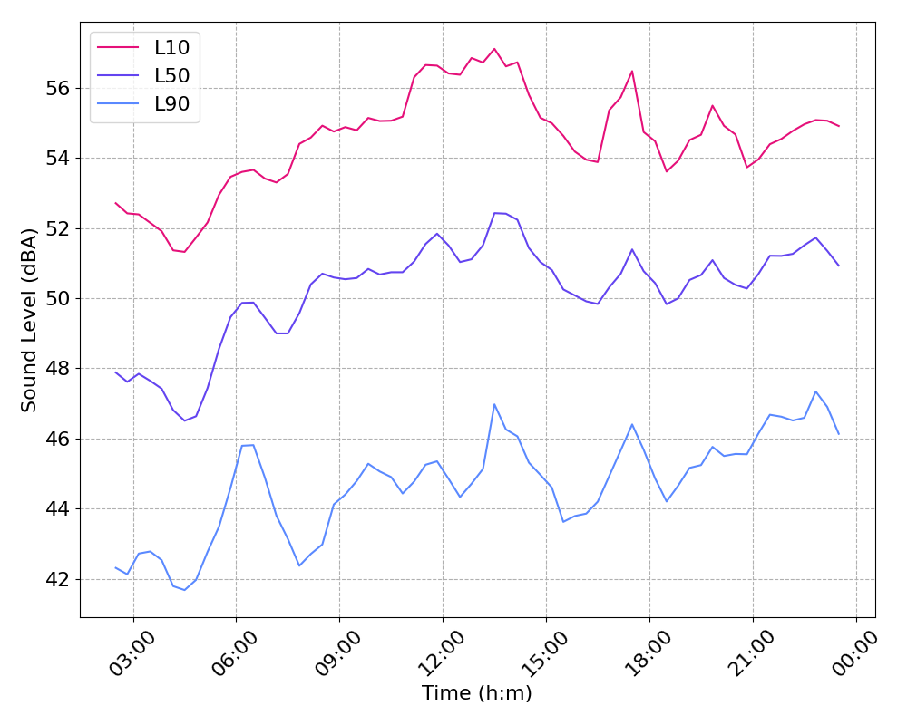

# soundmonitor

Python package for sound level monitor (long-term sound level meter) data analysis. Contains various fonctions to analyze and plot sliding averages, weekly and daily averages for noise descriptors such as the Lden, Leq and statistical indicators such as L10, L50 and L90 (see this [paper](https://hal.science/hal-01373857v3/file/doc00025834.pdf) for more details on these descriptors). The package works with equivalent sound level data (weighted or un-weighted) captured at regular intervals, typically ranging from 1 second to 1 minute.

## Installation

TBD

## Usage

### Read sound level monitor data

A function is included to read data in the form of either .csv, .xls, .xlsx or .txt files from a sound level monitor and convert them to a DataFrame with datetime or pandas TimeStamp index. Multiple files can be read at once, and the resulting data will be concatenated in a single DataFrame. Note that you must indicate the datasheet's indexes corresponding to date, time and captured equivalent sound level. Reading files with pandas and automatic parsing into datetime values can be computationaly expensive and the process can last a few minutes, depending on the input data.

```python
import os
from datetime import datetime

import soundmonitor as sm

# Load example .xslx data within the package
path = os.path.join('tests', 'data', 'test.xlsx')
df = sm.utilities.load_data([path], datetimeindex=0, valueindex=1)

# Filter out data between or outside specified dates and times if required
df = sm.utilities.filter_data(df, datetime(2022,8,10,3), datetime(2022,8,10,4), between=True)
```
Once sound level data is parsed into a proper dataframe, you can create a SoundMonitor class instance from it, which will be used for further analyses. 

```python
average = sm.SoundMonitor(df)
```

### Data analysis and plotting

The hard part is over, now you can just compute the descriptors you want from the SoundMonitor class instance. Individual average descriptors are returned as dictionnaries.

```python
# Equivalent level and percentiles between 7am and 12am
leq_am = average.leq(7, 12) 

# Same between 3pm and 7pm on weekends
leq_pm_weekends = average.leq(15, 19, day1='saturday', day2='sunday') 

# Lden overall
lden_all = average.lden() 

# Lden from mondays to fridays
lden_weekdays = average.lden(day1='monday', day2='friday') 
```

General, daily or weekly sliding averages are returned as DataFrames with datetime (for general averages) or time (for daily and weekly averages) index, and with columns including the corresponding Leq, L10, L50 and L90 values, respectively.

```python
# sliding average with a window size of 3600s (1 hour) and a step size of 1200s (20 minutes)
general = average.sliding_average(win=3600, step=1200) 

# daily average from 9pm to 7am
daily = average.daily(21, 7, win=3600, step=1200)

# weekday average from 2am to 11pm
weekday = average.weekly(2, 23, 'monday', 'friday', win=3600, step=1200)

# weekend average from 2am to 11pm
weekend = average.weekly(2, 23, 'saturday', 'sunday', win=3600, step=1200)
```

These sliding averages can be plotted using level_plot function.

```python
sm.utilities.level_plot(general, 'Leq') # Showing general Leq values
```


```python
sm.utilities.level_plot(daily, 'Leq', 'L10', 'L50', 'L90') # Showing daily night values
```


```python
sm.utilities.level_plot(weekday, 'L10', 'L50', 'L90') # Showing weekday percentiles values
```


```python
sm.utilities.level_plot(weekend, 'L10', 'L50', 'L90') # Showing weekend percentiles values
```

